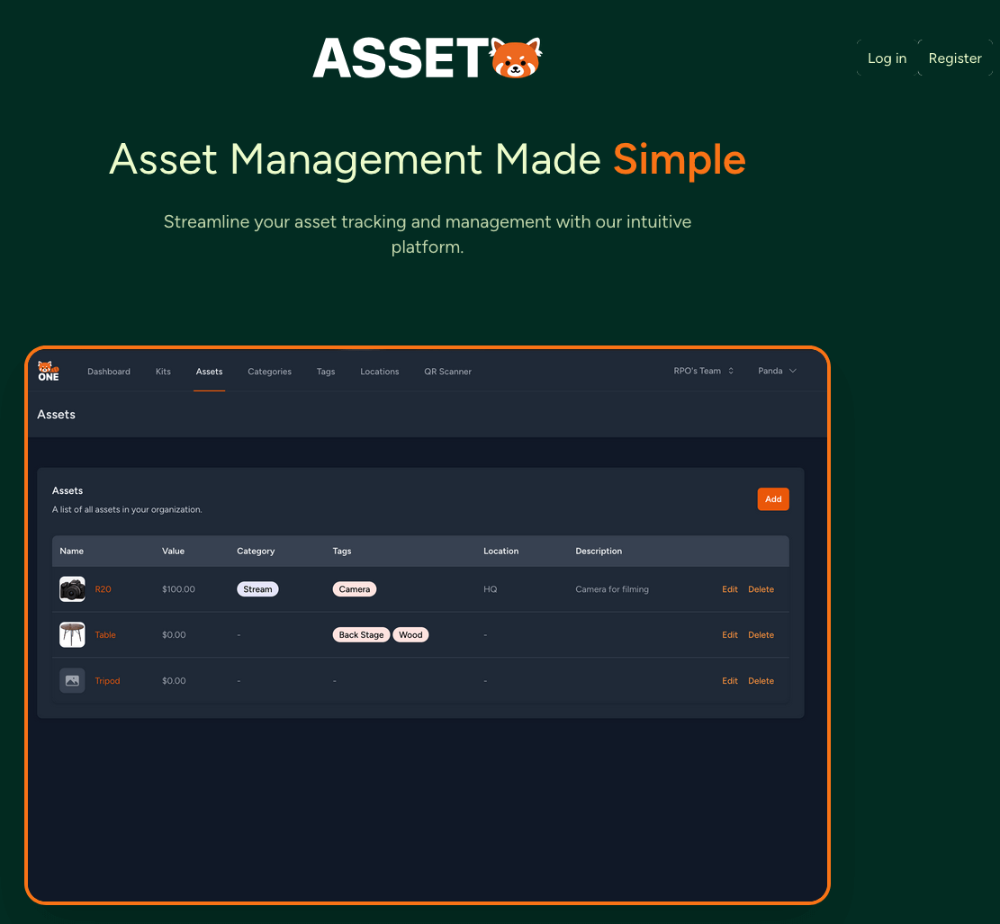
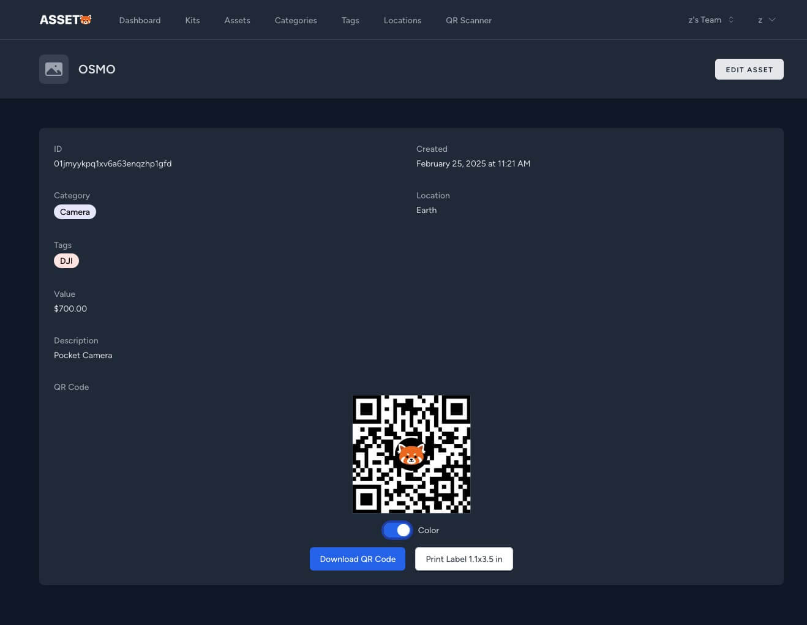
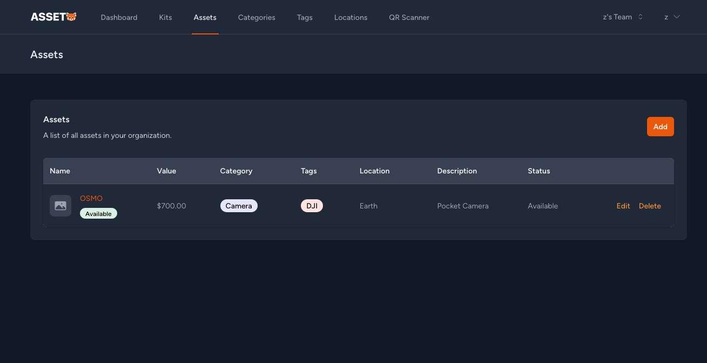

<p align="center"><a href="#"></a></p>

## About Asset by Red Panda One
Asset is a Laravel package that provides a simple way to manage assets in your Laravel application. 

<div style="display: flex; justify-content: space-around; flex-wrap: wrap;">
    
    
    
</div>


## Deployment
For deployment, please use the following docker-compose.prod.yml file:
docker/docker-compose.prod.yml

## Development
Laravel Sail is used for development. To start the development environment, run the following command:
```bash
./vendor/bin/sail up -d
```
## Red Panda One Version System

We use a bamboo-inspired versioning system to track the development of our project, reflecting its growth from initial concept to mature product:

* **Seedling (0.x.x):** The first experimental version. Like a seedling just breaking through the soil, this Minimum Viable Product (MVP) is fragile and still under heavy development.  It's intended for internal testing and feedback from a select group.  Expect significant changes and instability in this phase.  The `x` represents an incremental build number.

* **Shoot (0.y.z):** Growing stronger from the seedling phase.  This version is more feature-rich and stable than the Seedling release, and it's ready for beta testing and feedback from a wider audience. The `y` represents new feature additions or significant changes, while `z` represents bug fixes and minor improvements within the Shoot phase.

* **Bamboo (1.0.0+):** The mature, stable release. Like bamboo, it's strong and resilient, ready for the market and general public use. This marks the first production-ready version. Subsequent releases follow Semantic Versioning (MAJOR.MINOR.PATCH), aligning with industry best practices for clarity and predictability.

    * **MAJOR (e.g., 2.0.0):**  Incremented for incompatible API changes or significant new functionality.
    * **MINOR (e.g., 1.1.0):** Incremented for adding new features in a backward-compatible manner.
    * **PATCH (e.g., 1.0.1):** Incremented for backward-compatible bug fixes.

**Example:**

* Seedling: 0.1.0, 0.2.0, 0.2.1 (internal testing)
* Shoot: 0.3.0, 0.4.0, 0.4.1 (beta testing)
* Bamboo: 1.0.0, 1.0.1, 1.1.0, 2.0.0 (production releases)
